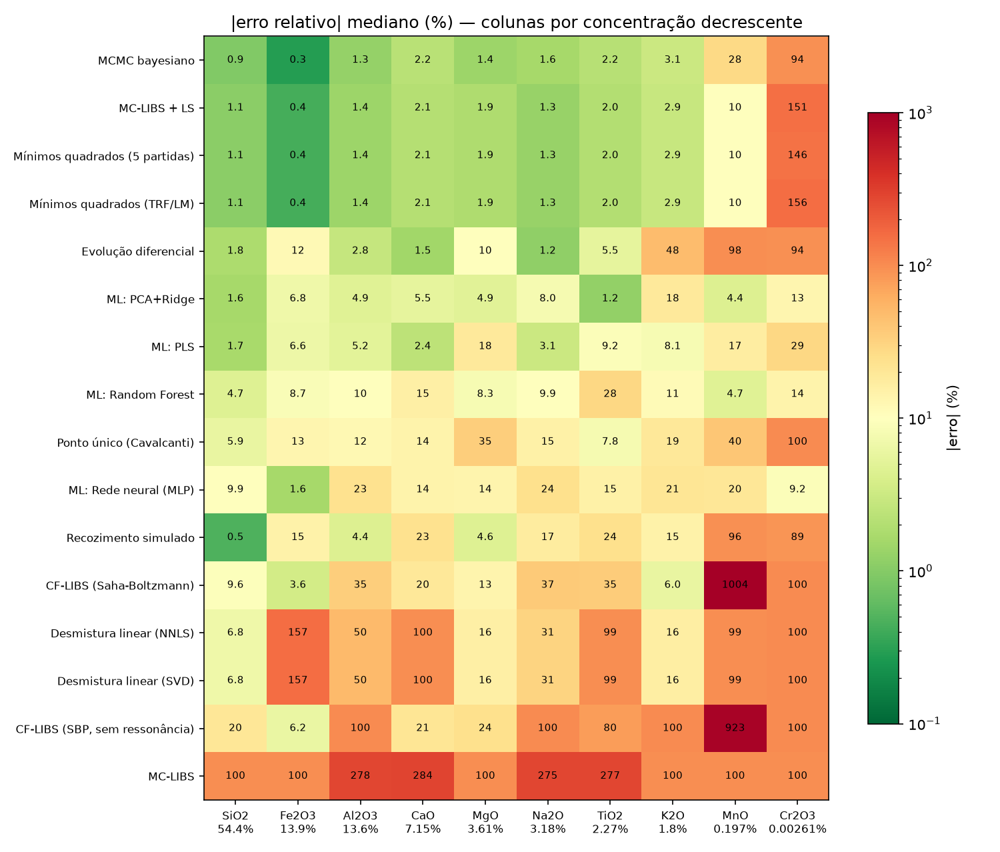

# cflibs-bench: algoritmos de LIBS sem calibração em espectros sintéticos

Este repositório é uma bancada de testes em Python para comparar algoritmos de
**LIBS sem calibração (CF-LIBS)** em espectros sintéticos de amostras
**geológicas**. Como o espectro de teste é gerado por um modelo físico
conhecido, todos os parâmetros "verdadeiros" (T, composição) são conhecidos. Isso
permite separar o erro **intrínseco** de cada algoritmo dos erros instrumentais,
como propõem Gornushkin & Völker (*Sensors* 2022).

```
espectro sintético (modelo LTE + autoabsorção + função instrumental Echelle + ruído)
        │
        ├── problema direto ── MC-LIBS · recozimento simulado · evolução diferencial
        │                      mínimos quadrados (TRF/LM) · MCMC bayesiano · desmistura linear (SVD/NNLS)
        ├── problema inverso ─ CF-LIBS Saha–Boltzmann · calibração de ponto único
        └── aprendizado de máquina ─ PLS · PCA+Ridge · Random Forest · rede neural (MLP)
```

## Instalação

```bash
pip install -e .            # numpy, scipy, pandas, matplotlib, scikit-learn
pip install SimulatedLIBS   # opcional: espectros do NIST (precisa de internet)
pytest                      # 9 testes, cerca de 10 s
```

## Uso rápido

```bash
python examples/01_inicio_rapido.py                       # basalto + MC-LIBS, SBP e ponto único
python -m cflibs_bench.benchmark --list                   # algoritmos disponíveis
python -m cflibs_bench.benchmark --sample basalto --algorithms all --seeds 3 --out resultados
python -m cflibs_bench.benchmark --sample granito --T 8000 --noise 0.01 --algorithms mc_ls,sbp,one_point
CFLIBS_QUICK=1 python -m cflibs_bench.benchmark --algorithms all   # versão rápida (menos iterações)
python examples/02_estudo_ruido.py                         # erro vs. nível de ruído
python examples/03_simulatedlibs_nist.py                   # espectro do SimulatedLIBS/NIST (online)
```

Uso como biblioteca:

```python
from cflibs_bench import PlasmaModel, SAMPLES, add_noise
from cflibs_bench.algorithms import MonteCarloCF

model = PlasmaModel(wl_range=(300, 780), ne=1e17, resolving_power=10000)
spec = add_noise(model.simulate_sample(SAMPLES["basalto"], T=10000), 0.005, rng=1)
res = MonteCarloCF(model, polish=True, seed=0).fit(spec)
print(res.T, res.oxide_wt)          # temperatura e % em massa de óxidos
```

## O modelo direto (`cflibs_bench/model.py`)

O modelo descreve um plasma homogêneo e isotérmico em LTE, segundo as eq. 1–2 de Gornushkin & Völker:

* I(λ) = B(λ,T)·[1 − exp(−τ(λ))], com τ = Σ K_l(T, n, R)·P_l(λ). A autoabsorção e
  a sobreposição de linhas entram automaticamente no cálculo. No basalto a 10 000 K,
  Ca II 393 nm tem τ ≈ 86, e Na I 589 nm e Al I 396 nm têm τ ≈ 3.
* O equilíbrio entre neutros e íons vem da equação de Saha, com n_e fixo.
* O perfil das linhas é Lorentziano (Stark), convoluído com uma gaussiana
  instrumental de largura λ/R (para um Echelle, R ≈ 5 000–20 000).
* A grade é dividida em **fragmentos** de ±0,5 nm em torno de cada linha, como no artigo.
* A síntese é **vetorizada**: um único lote de milhares de configurações gera uma
  matriz (N_c, M), a cerca de 0,7 ms por espectro em CPU. Trocar `numpy` por
  `cupy` deve permitir rodar em GPU, como faz o artigo, mas isso não foi testado.

**Dados atômicos:** 74 linhas de Ca, Al, Mg, Si, Fe, Mn, Ti e Cr (Tabela 2 do
artigo do MC-LIBS), mais Na I 589 nm e K I 766/770 nm. As **funções de partição e
as larguras Stark são aproximações** tabeladas. Como o espectro de teste e os
algoritmos usam o mesmo modelo, essas aproximações não afetam a comparação entre
algoritmos. Para espectros reais, substitua-as por valores do NIST e de Griem
(`atomic_data.py`).

**Amostras incluídas** (`composition.py`, valores aproximados): basalto (BCR-2),
andesito (AGV-2), granito (G-2) e a escória do artigo. As composições estão em
% de óxidos e são convertidas para frações atômicas dos cátions.

## Algoritmos (`cflibs_bench/algorithms/`)

| chave | algoritmo | ideia | referência |
|---|---|---|---|
| `mc` | **MC-LIBS** | Sorteia N_c configurações (T, R, n_i), escolhe as N_b melhores e encolhe caixas em torno delas, mantendo uma fração α global. | Demidov et al.; Gornushkin & Völker 2022 |
| `mc_ls` | MC-LIBS + LS | Híbrido: o MC encontra a bacia do mínimo e os mínimos quadrados refinam. | — |
| `sa` | Recozimento simulado | `scipy.optimize.dual_annealing` aplicado à mesma função de custo. | Gornushkin et al.; Herrera et al. |
| `de` | Evolução diferencial | Algoritmo genético com a população avaliada em lote. | — |
| `ls`, `ls_multi` | Mínimos quadrados (TRF/LM) | Otimização local determinística, com um ou vários pontos de partida. Mostra o risco de mínimos locais. | — |
| `mcmc` | **MCMC bayesiano** | Ensemble affine-invariant (como o emcee). Dá a distribuição a posteriori e, portanto, **incertezas** e intervalos de credibilidade. | Goodman & Weare 2010 |
| `nnls`, `svd` | Desmistura linear | Resolve y ≈ Σ c_e·b_e(T) com bases opticamente finas, por NNLS ou SVD, varrendo T. | Yaroshchyk et al. 2006 |
| `sbp`, `sbp_nores` | CF-LIBS Saha–Boltzmann | Gráfico multielemento com inclinação comum e fechamento em 100 %. A variante `sbp_nores` exclui linhas de ressonância. | Ciucci et al. 1999 |
| `one_point` | Calibração de ponto único | Calcula um fator de correção por linha a partir de **um** padrão de matriz similar. | Cavalcanti et al. 2013 |
| `ml_*` | Regressão por ML | Treinada com espectros sintéticos (pré-processamento log; alvos T e CLR das frações): PLS, PCA+Ridge, RF, MLP. | Gąsior et al. 2023 |

Funções de custo (`cost.py`), todas invariantes à escala absoluta e calculadas em lote:

* `corr`: eq. 4 do artigo (1 − correlação).
* `wcorr`: eq. 5 do artigo, ponderada por elemento e por fragmento. É o padrão.
* `wcorr_eq`: variante experimental em que cada fragmento é normalizado pela própria energia.

## Resultado de referência

Gerado com `python -m cflibs_bench.benchmark --algorithms all --seeds 3 --out resultados_exemplo`.
O teste é um basalto a 10 000 K, com ruído gaussiano de 0,5 % do máximo e R = 10 000.
O andesito serve de padrão para o ponto único. A tabela mostra a mediana do |erro relativo|
por classe de concentração; a classe "traço" contém só o Cr₂O₃ (26 ppm). Os arquivos
completos estão em [`resultados_exemplo/`](resultados_exemplo/).

| algoritmo | maiores >1 % | menores 0,1–1 % | traço (Cr₂O₃) | \|ΔT\| (K) | tempo (s) | avaliações |
|---|---:|---:|---:|---:|---:|---:|
| Mínimos quadrados (TRF/LM) | 1.4 % | 10 % | 151 % | 7 | 3.5 | 651 |
| MC-LIBS + LS | 1.4 % | 10 % | 151 % | 7 | 13.3 | 42.249 |
| MCMC bayesiano | 1.5 % | 28 % | 94 % | 8 | 12.5 | 59.752 |
| Evolução diferencial | 4.9 % | 98 % | 94 % | 69 | 7.1 | 38.656 |
| ML: PLS | 5.9 % | 17 % | 29 % | 57 | 3.6 | 1.500 |
| ML: PCA+Ridge | 6.1 % | 8 % | 7 % | 97 | 2.5 | 1.500 |
| ML: Random Forest | 9.4 % | 8 % | 18 % | 659 | 4.5 | 1.500 |
| ML: Rede neural (MLP) | 10.4 % | 22 % | 4 % | 213 | 3.8 | 1.500 |
| Ponto único (Cavalcanti) | 12.7 % | 40 % | 100 % | 562 | 0.0 | 0 |
| Recozimento simulado | 13.6 % | 96 % | 89 % | 565 | 34.8 | 15.040 |
| CF-LIBS (Saha-Boltzmann) | 14.6 % | 1004 % | 100 % | 510 | 0.0 | 0 |
| Desmistura linear (SVD) | 39.9 % | 99 % | 100 % | 9687 | 0.1 | 38 |
| Desmistura linear (NNLS) | 39.9 % | 99 % | 100 % | 9687 | 0.1 | 38 |
| CF-LIBS (SBP. sem ressonância) | 50.9 % | 923 % | 100 % | 332 | 0.0 | 0 |
| MC-LIBS | 100.0 % | 100 % | 100 % | 22 | 24.0 | 82.000 |



**Como ler os resultados:**

1. **Métodos de problema direto** (MC + LS, mínimos quadrados e MCMC) chegam a cerca de 1 % de erro
   nos óxidos maiores mesmo com forte autoabsorção, porque o modelo já contém a autoabsorção e a
   sobreposição de linhas. Isso reproduz a conclusão de Gornushkin & Völker. Os otimizadores
   puramente estocásticos (MC sozinho, recozimento simulado, evolução diferencial) precisam de muito
   mais avaliações em 12 dimensões. O artigo usa de 10⁵ a 10⁶ configurações por iteração em GPU.
   Em CPU, o híbrido estocástico + local é a melhor relação custo/benefício.
2. **O CF-LIBS por Saha–Boltzmann** sofre com a autoabsorção (Ca II, Al I, Na I) e com o fechamento
   em 100 %. O erro nos elementos maiores se propaga para os menores. Perto do limite de detecção,
   uma única flutuação de ruído aceita a 3σ pode multiplicar a concentração de um traço (veja o MnO).
   Excluir as linhas de ressonância também elimina o Na e o K, que só têm linhas de ressonância.
3. **A calibração de ponto único** corrige boa parte desses vieses usando um único padrão.
4. **A desmistura linear (SVD/NNLS)** é exata para plasma opticamente fino (veja os testes), mas
   falha quando há autoabsorção. Isso a torna um bom controle negativo.
5. **O ML** acerta bem os elementos maiores, mas os "acertos" em traços não detectáveis vêm da
   distribuição de treino (o prior), não do espectro. É um alerta importante antes de usar ML em
   amostras reais.
6. **O MCMC** fornece intervalos de 16–84 % para cada óxido. Para o Cr₂O₃ (26 ppm), o intervalo
   é de 0,002 a 0,04 %, o que na prática funciona como um limite superior. Nenhum método de
   otimização fornece essa informação.

## SimulatedLIBS e NIST

O pacote [SimulatedLIBS](https://pypi.org/project/SimulatedLIBS/), usado por Gąsior et al. para
gerar dados de treino, consulta o formulário LIBS do NIST. O adaptador
`cflibs_bench/adapters/simulatedlibs.py` faz três coisas:

* `spectrum_from_simulatedlibs(...)` gera um espectro do NIST (com cache em CSV) e o devolve como
  `Spectrum`, com a composição verdadeira anexada.
* Inverter esse espectro com o `PlasmaModel` testa os algoritmos sob **erro de modelo**, já que o
  NIST usa outro banco de linhas e assume plasma opticamente fino. É o passo intermediário antes
  de usar dados reais do Echelle.
* `dataset_from_simulatedlibs(...)` cria conjuntos de treino para ML, como fizeram Gąsior et al.

O ambiente em que este código foi desenvolvido não tinha acesso ao NIST, então o adaptador e o
exemplo 03 **não foram executados**. Rode-os localmente.

## Próximos passos

* **Dados reais do Echelle**: corrigir a resposta espectral, subtrair a linha de base, ajustar
  `resolving_power` e `ne`, e carregar o espectro com `Spectrum.from_csv`.
* **Mais física**: perfil de Voigt, larguras Stark do Griem, contínuo, plasma em duas zonas
  (gradientes, como em Hermann et al.) e n_e como parâmetro livre.
* **Mais algoritmos**:
  * método C-sigma (curvas de crescimento; Aragón & Aguilera);
  * correção de autoabsorção por *duplicating mirror* ou pelo método de Bulajic;
  * CMA-ES e otimização bayesiana com processo gaussiano, para reduzir o número de avaliações;
  * redes neurais treinadas no espectro completo como *surrogate* do modelo direto, para
    acelerar o MC;
  * PCA/ICA para separar elementos.
* **Estudos sistemáticos**: erro em função de R (resolução), do ruído, da janela temporal
  (variando T) e da escolha das linhas (por exemplo, o Si com uma única linha).

## Referências

* I. B. Gornushkin, T. Völker, *Intrinsic Performance of Monte Carlo Calibration-Free Algorithm for
  LIBS*, Sensors 22 (2022).
* P. Gąsior et al., *Analysis of hydrogen isotopes retention in thermonuclear reactors with LIBS
  supported by machine learning*, Spectrochim. Acta B 199 (2023) 106576.
* O. Rosales-Martínez et al., *A Python-based web tool to simulate atomic optical emission spectra*,
  J. Appl. Res. Technol. 24 (2026) 42–52.
* A. Ciucci et al., Appl. Spectrosc. 53 (1999) 960. E. Tognoni et al., Spectrochim. Acta B 65 (2010) 1.
* G. H. Cavalcanti et al., Spectrochim. Acta B 87 (2013) 51.
* P. Yaroshchyk et al., Spectrochim. Acta B 61 (2006) 200.
